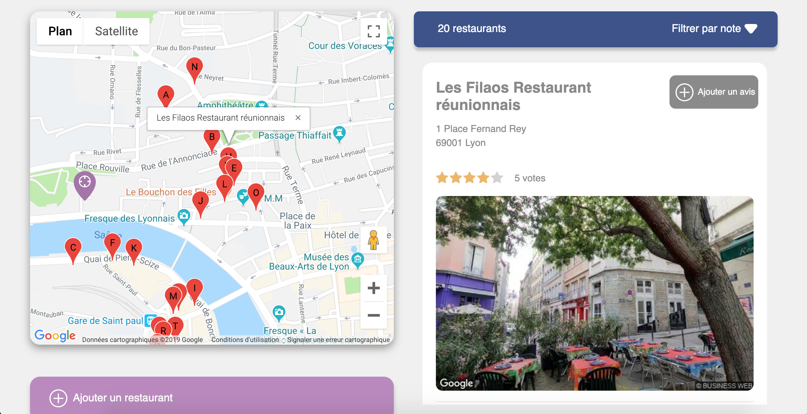
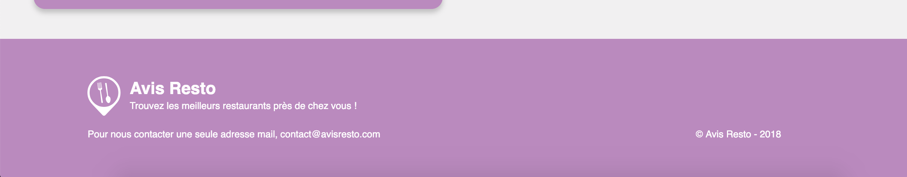

# Debug Todo list mvc app

## What is "Avis-resto" for ?

Based on the Google Maps and Places APIs, "Avis-resto" detects restaurants close to you.

Boostrap // API Google Maps & Places // Javascript // Object Oriented Programming // Responsive